```markdown
# Advanced Email Processing System 📧✨


An end-to-end email processing pipeline featuring AI-powered summarization, advanced attachment parsing, and multi-format support.

## 🌟 Key Features

- **Multi-Format Email Parsing**
  - Native `.eml` and Outlook `.msg` support
  - Metadata extraction (From/To/Subject/Date)
  - MIME-aware body parsing

- **AI Summarization**
  - Groq API integration (Llama 3 70B model)
  - Structured prompt engineering
  - Rate-limited API calls

- **Smart Attachment Processing**
  - PDF text extraction (PyPDF2)
  - Word document parsing (python-docx)
  - Image OCR (Tesseract)
  - Graceful fallback handling

- **RESTful API**
  - File upload endpoint
  - Batch processing
  - JSON results API

## 🏗️ Architecture Deep Dive

```mermaid
%%{init: {
  'theme': 'base',
  'themeVariables': {
    'primaryColor': '#2E86AB',
    'primaryTextColor': '#FFFFFF',
    'primaryBorderColor': '#1C5F7C',
    'lineColor': '#4A90A4',
    'secondaryColor': '#A23B72',
    'tertiaryColor': '#F18F01',
    'background': '#FFFFFF',
    'mainBkg': '#F8F9FA',
    'secondBkg': '#E9ECEF'
  }
}}%%

graph TB
    %% Input Layer
    subgraph INPUT ["🎯 INPUT LAYER"]
        direction TB
        UI["🌐 Web Upload Interface<br/><small>Multi-file drag & drop</small>"]
        API["🔌 REST API Gateway<br/><small>JSON/Form-data endpoints</small>"]
        FILES["📧 Email Files<br/><small>.eml / .msg formats</small>"]
    end

    %% API Endpoints
    subgraph ENDPOINTS ["🚀 API ENDPOINTS"]
        direction LR
        UPLOAD["📤 POST /upload<br/><small>File acceptance</small>"]
        PROCESS["⚙️ POST /api/process<br/><small>Pipeline trigger</small>"]
        RESULTS["📊 GET /api/results/id<br/><small>Data retrieval</small>"]
        SAVE["💾 POST /api/save-summary<br/><small>Edit persistence</small>"]
    end

    %% Core Engine
    subgraph CORE ["🎛️ CORE PROCESSING ENGINE"]
        direction TB
        ORCHESTRATOR["🎯 Processing Orchestrator<br/><small>app.py - Main controller</small>"]
        PIPELINE["⚡ Pipeline Manager<br/><small>Workflow coordination</small>"]
        STORAGE["🗄️ Result Storage<br/><small>Data persistence layer</small>"]
    end

    %% Email Parser
    subgraph PARSER_MODULE ["📧 EMAIL PARSER MODULE"]
        direction TB
        PARSER["🔍 Format Parser<br/><small>email_parser.py</small>"]
        
        subgraph PARSERS ["Format Handlers"]
            EML["📄 EML Parser<br/><small>RFC 2822 compliant</small>"]
            MSG["📮 MSG Parser<br/><small>Outlook format</small>"]
        end
        
        subgraph EXTRACTORS ["Data Extractors"]
            META["📋 Metadata<br/><small>From/To/Subject/Date</small>"]
            BODY["📝 Body Content<br/><small>HTML/Plain text</small>"]
            ATTACH["📎 Attachments<br/><small>MIME parts</small>"]
        end
    end

    %% Document Processor
    subgraph DOC_MODULE ["📁 DOCUMENT PROCESSOR"]
        direction TB
        DOC_PROC["🔧 Universal Processor<br/><small>document_processor.py</small>"]
        
        subgraph PROCESSORS ["Content Processors"]
            PDF_PROC["📕 PDF Extractor<br/><small>PyPDF2 engine</small>"]
            DOCX_PROC["📘 DOCX Parser<br/><small>python-docx</small>"]
            OCR_PROC["👁️ OCR Engine<br/><small>Tesseract integration</small>"]
        end
        
        TYPE_DETECT["🔍 Type Detection<br/><small>MIME & signature analysis</small>"]
        FALLBACK["🛡️ Fallback Handler<br/><small>Error recovery</small>"]
    end

    %% AI Summarizer
    subgraph AI_MODULE ["🤖 AI SUMMARIZATION ENGINE"]
        direction TB
        SUMMARIZER["🧠 EmailSummarizer<br/><small>summarizer.py</small>"]
        
        subgraph AI_COMPONENTS ["AI Components"]
            GROQ_CLIENT["⚡ Groq Client<br/><small>API integration</small>"]
            RATE_LIMITER["⏱️ Rate Limiter<br/><small>1 req/sec throttling</small>"]
            PROMPT_ENGINE["📝 Prompt Engine<br/><small>Structured templates</small>"]
        end
        
        RETRY_LOGIC["🔄 Retry Logic<br/><small>Error handling</small>"]
        MODEL["🦙 Llama 3 70B<br/><small>Meta's flagship model</small>"]
    end

    %% External Services
    subgraph EXTERNAL ["🌐 EXTERNAL SERVICES"]
        direction LR
        GROQ_API["🚀 Groq API<br/><small>meta-llama/llama-3-70b</small>"]
        TESSERACT["🔍 Tesseract OCR<br/><small>Google's OCR engine</small>"]
    end

    %% Data Layer
    subgraph DATA ["💾 DATA PERSISTENCE"]
        direction LR
        JSON_STORE["📊 JSON Storage<br/><small>Structured results</small>"]
        TEMP_FILES["⏳ Temp Storage<br/><small>Processing cache</small>"]
        PROCESSED["✅ Processed Data<br/><small>Final outputs</small>"]
    end

    %% Main Flow Connections
    INPUT --> ENDPOINTS
    ENDPOINTS --> CORE
    CORE --> PARSER_MODULE
    CORE --> AI_MODULE
    
    %% Parser Flow
    PARSER --> PARSERS
    PARSERS --> EXTRACTORS
    EXTRACTORS --> DOC_MODULE
    
    %% Document Processing Flow
    ATTACH --> DOC_PROC
    DOC_PROC --> TYPE_DETECT
    TYPE_DETECT --> PROCESSORS
    PROCESSORS --> FALLBACK
    
    %% AI Processing Flow
    META --> SUMMARIZER
    BODY --> SUMMARIZER
    FALLBACK --> SUMMARIZER
    SUMMARIZER --> AI_COMPONENTS
    AI_COMPONENTS --> RETRY_LOGIC
    RETRY_LOGIC --> MODEL
    
    %% External Connections
    GROQ_CLIENT -.->|API Calls| GROQ_API
    OCR_PROC -.->|OCR Processing| TESSERACT
    MODEL -.->|LLM Inference| GROQ_API
    
    %% Storage Flow
    RETRY_LOGIC --> DATA
    STORAGE --> DATA

    %% Modern Styling
    classDef inputStyle fill:#667eea,stroke:#764ba2,stroke-width:3px,color:#fff,font-weight:bold
    classDef apiStyle fill:#f093fb,stroke:#f5576c,stroke-width:3px,color:#fff,font-weight:bold
    classDef coreStyle fill:#4facfe,stroke:#00f2fe,stroke-width:3px,color:#fff,font-weight:bold
    classDef parserStyle fill:#43e97b,stroke:#38f9d7,stroke-width:3px,color:#fff,font-weight:bold
    classDef docStyle fill:#fa709a,stroke:#fee140,stroke-width:3px,color:#fff,font-weight:bold
    classDef aiStyle fill:#a8edea,stroke:#fed6e3,stroke-width:2px,color:#2d3748,font-weight:bold
    classDef externalStyle fill:#ff9a9e,stroke:#fecfef,stroke-width:3px,color:#fff,font-weight:bold
    classDef dataStyle fill:#a18cd1,stroke:#fbc2eb,stroke-width:3px,color:#fff,font-weight:bold
    classDef componentStyle fill:#e0c3fc,stroke:#9bb5ff,stroke-width:2px,color:#2d3748,font-weight:600

    %% Apply Styles
    class INPUT inputStyle
    class ENDPOINTS apiStyle
    class CORE coreStyle
    class PARSER_MODULE parserStyle
    class DOC_MODULE docStyle
    class AI_MODULE aiStyle
    class EXTERNAL externalStyle
    class DATA dataStyle
    
    class UI,API,FILES,UPLOAD,PROCESS,RESULTS,SAVE,ORCHESTRATOR,PIPELINE,STORAGE componentStyle
    class PARSER,EML,MSG,META,BODY,ATTACH,DOC_PROC,PDF_PROC,DOCX_PROC,OCR_PROC,TYPE_DETECT,FALLBACK componentStyle
    class SUMMARIZER,GROQ_CLIENT,RATE_LIMITER,PROMPT_ENGINE,RETRY_LOGIC,MODEL componentStyle
    class GROQ_API,TESSERACT,JSON_STORE,TEMP_FILES,PROCESSED componentStyle

```



## 📂 Core Components

### `email_parser.py`
```python
def parse_email(email_path):
    """Windows-friendly MIME parser with:
    - Multi-part email handling
    - Attachment extraction
    - Error-resilient decoding
    """
```

### `summarizer.py`
```python
class EmailSummarizer:
    """Groq-powered AI summarizer featuring:
    - Rate-limited API calls (1/sec)
    - Structured prompt engineering
    - Error handling with retries
    """
```

### `document_processor.py`
```python
def process_attachment(attachment):
    """Universal attachment processor with:
    - File type detection
    - PDF/DOCX/Image handling
    - Cascading fallback logic
    """
```

### `app.py`
```python
@app.route('/api/process')
def process_email():
    """Orchestrates the full pipeline:
    1. Email parsing
    2. Attachment processing
    3. AI summarization
    4. Result storage
    """
```

## 🔌 API Endpoints

| Endpoint | Method | Description |
|----------|--------|-------------|
| `/upload` | POST | Accepts .eml/.msg files |
| `/api/process` | POST | Triggers email processing |
| `/api/results/<id>` | GET | Retrieves processed results |
| `/api/save-summary` | POST | Saves edited summaries |

## 🚀 Deployment Guide

### Prerequisites
- Groq API key
- Tesseract OCR installed
- Python 3.8+

```bash
# Installation
git clone https://github.com/your-repo/email-ai-agent.git
cd email-ai-agent
python -m venv venv
source venv/bin/activate
pip install -r requirements.txt

# Configuration
echo "GROQ_API_KEY=your_key_here" > .env
echo "SECRET_KEY=$(openssl rand -hex 32)" >> .env

# Running
flask run --host=0.0.0.0 --port=5000
```

### Docker Setup
```dockerfile
FROM python:3.8-slim
RUN apt-get update && apt-get install -y \
    tesseract-ocr \
    libtesseract-dev
COPY . /app
WORKDIR /app
RUN pip install -r requirements.txt
CMD ["gunicorn", "--bind", "0.0.0.0:5000", "src.app:app"]
```

## 📊 Sample API Response

```json
{
  "processing_timestamp": "2023-11-15T12:34:56",
  "email": {
    "from": "sender@example.com",
    "subject": "Quarterly Report",
    "date": "Thu, 16 Nov 2023 09:00:00 +0000"
  },
  "summary": {
    "content": "The email discusses Q3 results...",
    "model": "meta-llama/llama-3-70b",
    "status": "success"
  },
  "attachments": [
    {
      "filename": "report.pdf",
      "type": "pdf",
      "text": "Extracted PDF content..."
    }
  ]
}
```

## 🛠️ Development Notes

### Attachment Processing Logic
1. **Primary Detection**:
   ```python
   if filename.endswith('.pdf'):
       return _process_pdf(payload)
   ```
2. **Content Sniffing**:
   ```python
   if payload.startswith(b'%PDF'):
       return _process_pdf(payload)
   ```
3. **Fallback**:
   ```python
   return {
       'type': 'unknown',
       'error': 'Unprocessable format'
   }
   ```

### Groq API Integration
```python
payload = {
    "model": "meta-llama/llama-3-70b",
    "messages": [
        {"role": "system", "content": "You are an email summarization expert"},
        {"role": "user", "content": formatted_prompt}
    ],
    "temperature": 0.3,
    "max_tokens": 300
}
```

## 📜 License
MIT License - See [LICENSE](LICENSE) for details.

---

**Maintainers**  
Karan Kumar(mailto:karanyadav3775@gmail.com)  
```
